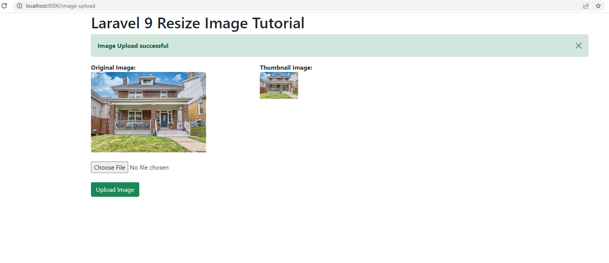

# laravel9_resize_image_before_upload
## 1: Install Laravel 9
```Dockerfile
composer create-project laravel/laravel laravel9_resize_image_before_upload
```
## 2:  Install Intervention Image Package
```Dockerfile
composer require intervention/image
```
## 3: Create Routes
- routes/web.php
```Dockerfile
<?php
  
use Illuminate\Support\Facades\Route;
  
use App\Http\Controllers\ImageController;
  
/*
|--------------------------------------------------------------------------
| Web Routes
|--------------------------------------------------------------------------
|
| Here is where you can register web routes for your application. These
| routes are loaded by the RouteServiceProvider within a group which
| contains the "web" middleware group. Now create something great!
|
*/
  
Route::controller(ImageController::class)->group(function(){
    Route::get('image-upload', 'index');
    Route::post('image-upload', 'store')->name('image.store');
});
```
## 4: Create Controller File
```Dockerfile
php artisan make:controller ImageController
```
- app/Http/Controllers/ImageController.php
```Dockerfile
<?php
  
namespace App\Http\Controllers;
  
use Illuminate\Http\Request;
use Image;
  
class ImageController extends Controller
{
    /**
     * Display a listing of the resource.
     *
     * @return \Illuminate\Http\Response
     */
    public function index()
    {
        return view('imageUpload');
    }
      
    /**
     * Display a listing of the resource.
     *
     * @return \Illuminate\Http\Response
     */
    public function store(Request $request)
    {
        $this->validate($request, [
            'image' => 'required|image|mimes:jpeg,png,jpg,gif,svg|max:2048',
        ]);
   
        $image = $request->file('image');
        $imageName = time().'.'.$image->extension();
       
        $destinationPathThumbnail = public_path('/thumbnail');
        $img = Image::make($image->path());
        $img->resize(100, 100, function ($constraint) {
            $constraint->aspectRatio();
        })->save($destinationPathThumbnail.'/'.$imageName);
     
        $destinationPath = public_path('/images');
        $image->move($destinationPath, $imageName);
     
        return back()
            ->with('success','Image Upload successful')
            ->with('imageName',$imageName);
    }
}
```
## 5: View File and Create Upload directory
- resources/views/imageUpload.blade.php
```Dockerfile
<!DOCTYPE html>
<html>
<head>
    <title>Laravel 9 Resize Image Tutorial</title>
    <link href="https://cdnjs.cloudflare.com/ajax/libs/twitter-bootstrap/5.0.1/css/bootstrap.min.css" rel="stylesheet">
</head>
<body>
    
<div class="container">
    <h1>Laravel 9 Resize Image Tutorial</h1>
    @if (count($errors) > 0)
        <div class="alert alert-danger">
            <strong>Whoops!</strong> There were some problems with your input.<br><br>
            <ul>
                @foreach ($errors->all() as $error)
                    <li>{{ $error }}</li>
                @endforeach
            </ul>
        </div>
    @endif
           
    @if ($message = Session::get('success'))
      
    <div class="alert alert-success alert-dismissible fade show" role="alert">
      <strong>{{ $message }}</strong>
      <button type="button" class="btn-close" data-bs-dismiss="alert" aria-label="Close"></button>
    </div>
  
    <div class="row">
        <div class="col-md-4">
            <strong>Original Image:</strong>
            <br/>
            
        </div>
        <div class="col-md-4">
            <strong>Thumbnail Image:</strong>
            <br/>
            
        </div>
    </div>
    @endif
            
    <form action="{{ route('image.store') }}" method="post" enctype="multipart/form-data">
        @csrf
        <div class="row">
            <div class="col-md-12">
                <br/>
                <input type="file" name="image" class="image">
            </div>
            <div class="col-md-12">
                <br/>
                <button type="submit" class="btn btn-success">Upload Image</button>
            </div>
        </div>
    </form>
</div>
    
</body>
</html>
```
## 6: Run Laravel App:
```Dockerfile
php artisan serve
```
- Vào http://localhost:8000/image-upload



